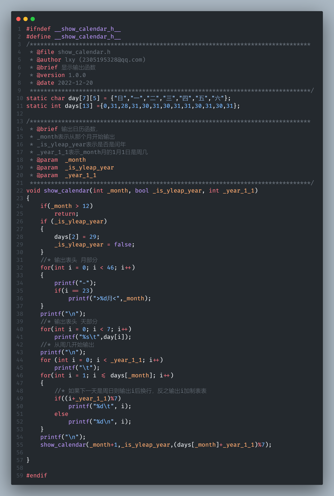

# perpetual-calendar-c

[本项目地址](https://github.com/SNDRI-2022/perpetual-calendar-c)

## 项目说明

c语言作业，远程仓库用于保存
使用Make编译工具

- 语言版本 c99
- 编辑器 Visual Studio Code(windows powershell)
- 编译器 gcc(MinGW64)
- 系统 windows11

```txt
perpetual-calendar-c    //项目目录
├─ .vscode     //vscode配置文件
│  ├─ launch.json
│  ├─ settings.json
│  └─ tasks.json
├─ include     //公共头文件目录
│  ├─ algorithm_MyWeek     //判断某年的1月1日是星期几
│  │  ├─ algorithm_MyWeek.c
│  │  └─ algorithm_MyWeek.h
│  ├─ leap_year      //判断是否是闰年
│  │  ├─ leap_year.c
│  │  └─ leap_year.h
│  └─ show_calendar     //输出日历函数
│     ├─ show_calendar.c
│     └─ show_calendar.h
├─ Makefile    //make配置文件
├─ output      //输出的可执行文件目录
│  └─ main.exe
├─ README.md      //帮助文档
└─ src      //源文件目录
   ├─ main.c
   └─ main.o

```

### 编译和运行

用make进行
详细配置文件在[Makefile](Makefile)中

用gcc进行
在项目目录右键打开终端 或 使用终端进入项目目录`cd perpetual-calendar-c`\

**注意**:这是在windows powershell中的命令，linux系统下去掉.exe并把;替换为&&

```powshell
gcc -std=c99 -g .\src\main.c -I .\include -o .\output\main.exe; .\output\main.exe
```

#### windows

1. windows中需要安装MinGW64
2. 打开终端(powershell或cmd)进入项目目录`cd perpetual-calendar-c`输入`MinGW32-make run`进行编译链接并运行

单编译只需要输入`MinGW32-make`

清除输出编译文件和输出文件只需要输入`MinGW32-make clean`

#### Linux和苹果系统

1. 打开终端进入项目目录`cd perpetual-calendar-c`输入`make run`进行编译链接并运行

单编译只需要输入`make`

清除输出编译文件和输出文件只需要输入`make clean`

## 测试

将用闰年2008和平年2022来测试


## 设计说明

程序设计步骤和思路

### main.c主文件说明

程序的开始
[main.c文件](./src/main.c)


#### 接收参数部分

从main函数开始第一行的`system("chcp 65001");`语句让c语言程序支持输出中文。year用于接收参数。当argc不为2时得知用户在运行程序中没有填写参数(年份)，并进行参数的填写再由argv2函数来判断输入的参数是否合法。在接收的字符串第5替换为`\0`防止接收过多大太参数，避免程序修改未分配的内存导致的异常终止，且限制参数为4位数之内。

#### 判断部分

布尔类型变量`is_yleap_year`接收`func_LeapYear(year)`函数的返回值，如果是闰年返回true反之返回false
整型类型`year_1_1`变量接收`func_MyWeek(year, is_yleap_year);`函数返回的值，返回程序接受参数`year`年1月1日是周几，0表示周日日，1表示周一。

#### 输出部分

`show_calendar(1, is_yleap_year, year_1_1);`函数将输出日历，第一个参数得知从第几月开始输出。这里1表示1月，第二个参数得知输出的年是否是闰年，第三个参数得知`参数1`是从周几开始输出。

### leap_year.h头文件说明

判断是否为闰年
[leap_year.h文件](./include/leap_year/leap_year.h)


#### leap_year.h设计思路

`bool func_LeapYear(int _year)`整型变量`_year`接收一个整形参数，能被400整除是闰年返回ture，反之进行二次判断，能被4整除但不能被100整除是闰年返回ture，反之不是闰年返回false

### algorithm_MyWeek.h头文件说明

返回某年1月1日是周日几
[algorithm_MyWeek.h文件](./include/algorithm_MyWeek/algorithm_MyWeek.h)


#### algorithm_MyWeek.h设计思路

`int func_MyWeek(int _year, bool _is_yleap_year)`整型变量`_year`接收年份为参数，布尔变量`_is_yleap_year`接收是否是闰年。通过公示可计算出`_year`年1月1日是周几并把值返回。

### show_calendar.h头文件说明

输出日历
[show_calendar.h文件](./include/show_calendar/show_calendar.h)


#### show_calendar.h设计思路

`static char day[7][5] = {"日","一","二","三","四","五","六"};`简易哈希表
`static int days[13] ={0,31,28,31,30,31,30,31,31,30,31,30,31};`简易哈希表

`void show_calendar(int _month, bool _is_yleap_year, int _year_1_1)`

`_month`从多少月开始输出，`_is_yleap_year`表示是否是闰年，`_year_1_1`表示`_month`月的1月1日是周几

当月份大于12月退出函数，当年份为闰年设置2月为29天并把`_is_yleap_year`标记为false防止重复赋值

#### 天数输出部分

当下一天为周日时输出本天日期本换行，反之输出本天日期和一个制表符
输出完一个月后换行

`show_calendar(_month+1,_is_yleap_year,(days[_month]+_year_1_1)%7);`递归调用自己，月价加1，闰年标记不变，`(days[_month]+_year_1_1)%7`用7对本月天数加本月从第几周开始值取模得到下个月1号是周几
